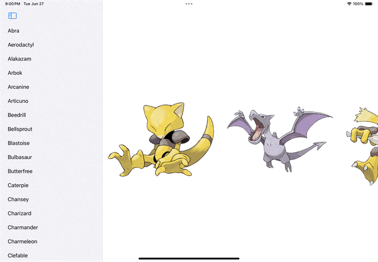

# Pokemon Animation
Project for the 24-Jun-2023 Flock of Swifts meetup showing the KeyFrame and Phase animations in iOS 17 using the following new language and SDK features:
* `@Observable` to drive view changes instead of `ObservableObject`
* `scrollTargetBehavior` to accomplish paginated scrolling
* `containerRelativeFrame` to show a fractional number of cells per page
* a `phaseAnimator`
* a `keyframeAnimator`

